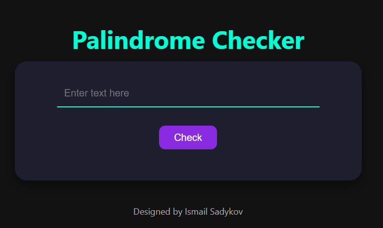

# Palindrome Checker

A simple web-based tool to check if a given string is a palindrome. Enter text and instantly see whether it reads the same forwards and backwards.

## Features

- **Live Check**: Enter any text and click **Check** to see if it’s a palindrome  
- **Case-Insensitive**: Ignores letter casing (e.g. “Madam” is detected as a palindrome)  
- **Whitespace & Punctuation Handling**: Strips spaces and common punctuation for accurate results  
- **Inline Styling & Logic**: All HTML, CSS, and JavaScript combined in a single `index.html` for easy portability  

## Demo
https://sadykovismail.github.io/Java-script/08-palindrome-checker/
Open `index.html` in your browser to try it out.



## Installation

_No build or external dependencies required!_

1. Clone this repo:  
   ```bash
   git clone https://github.com/sadykovIsmail/Java-script/tree/main/08-palindrome-checker
Open index.html in any modern browser.

Usage
Type or paste your text into the input field.

Click the Check button.

View the result message (“✅ It’s a palindrome!” or “❌ Not a palindrome.”).

To try another text, simply edit the input and click Check again.

Tech Stack
HTML5 with inline CSS for styling

Vanilla JavaScript embedded in index.html for palindrome logic

File Structure
palindrome-checker/
└── index.html    # All markup, styling, and script in one file
Contributing
1) Fork the repo

2) Create a new branch:
git checkout -b feature/<your-branch-name>

3) Commit your changes:
git commit -m "Add awesome feature"

4) Push to the branch:
git push -u origin feature/<your-branch-name>

5) Open a Pull Request