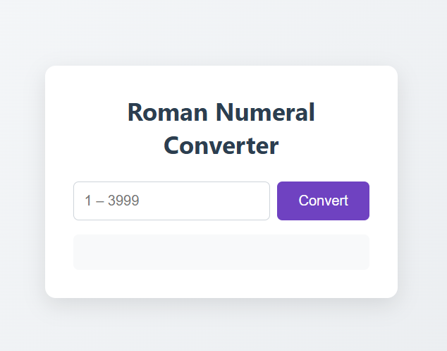

Roman Numeral Converter

A simple web application that converts integer numbers into Roman numerals. Enter any positive integer to instantly see its equivalent in Roman numerals.

Features

Number Input: Enter an integer number to convert (e.g., 4, 2024, 3999).

Live Conversion: Instantly converts and displays the Roman numeral result.

Validation: Checks for valid integer inputs (within the range of 1–3999).

Clear & Reset: Quickly reset the input and result with one click.

Responsive Design: Fully functional on desktop and mobile browsers.

Demo

Open index.html in your browser or view the live demo:https://sadykovismail.github.io/fcc-javascript-algorithms/02-roman-numeral-converter/

Installation

No build tools or external dependencies required!

Clone this repository:

git clone https://github.com/sadykovIsmail/fcc-javascript-algorithms/tree/main/02-roman-numeral-converter/

Open index.html in any modern web browser.

Usage

Type an integer number into the provided input field.

Click the Convert button (or press Enter).

See the result displayed instantly as a Roman numeral.

Click Clear to reset your input and the result.

Tech Stack

HTML5* for structure*

CSS3* for styling and responsive design*

Vanilla JavaScript (ES6+)* for conversion logic and DOM updates*

File Structure
roman-numeral-converter/
├── index.html            # Main HTML file
├── css/
│   └── styles.css        # Stylesheet for the app
├── js/
│   └── script.js         # Conversion logic and UI interactions
└── README.md             # Documentation

Contributing
1) Fork the repo

2) Create a new branch:
git checkout -b feature/<your-branch-name>

3) Commit your changes:
git commit -m "Add awesome feature"

4) Push to the branch:
git push -u origin feature/<your-branch-name>

5) Open a Pull Request