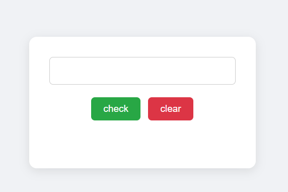

# Telephone Validator

A simple web app to validate telephone numbers against common formatting rules. Enter any phone number and instantly see if it’s valid.

## Features

- **Phone Number Input**: Type or paste any phone number  
- **Format Validation**: Checks against regex for various formats (e.g. `(123) 456-7890`, `123-456-7890`, `+1 123 456 7890`)  
- **Live Feedback**: Displays “Valid” or “Invalid” with color-coded text  
- **Error Messages**: Highlights specific issues (wrong length, invalid characters, missing area code)  
- **Clear & Reset**: One-click button to clear input and result  
- **Responsive Design**: Works on desktop and mobile browsers  

## Demo

Open `index.html` in your browser or view the live demo:  
<https://sadykovismail.github.io/fcc-javascript-algorithms/03-telephone-validator/>



## Installation

_No build tools or external dependencies required!_

1. Clone this repository:  
   ```bash
   git clone https://github.com/sadykovIsmail/fcc-javascript-algorithms/tree/main/03-telephone-validator/
Open index.html in any modern web browser.

## Usage
In the Phone Number field, enter the number you want to validate.

Click the Validate button (or press Enter).

See the validation result (“✅ Valid” or “❌ Invalid”) and any error details.

Click Clear to reset the input and result.

## Tech Stack
HTML5 for structure

CSS3 for styling and responsive design

Vanilla JavaScript (ES6+) for validation logic and DOM updates

## File Structure

telephone-validator/
├── index.html           # Main HTML page
├── css/
│   └── styles.css       # App styles
├── js/
│   └── script.js           # Validation logic and UI handlers
└── README.md            # Project documentation

## Contributing
1) Fork the repo

2) Create a new branch:
git checkout -b feature/<your-branch-name>

3) Commit your changes:
git commit -m "Add awesome feature"

4) Push to the branch:
git push -u origin feature/<your-branch-name>

5) Open a Pull Request