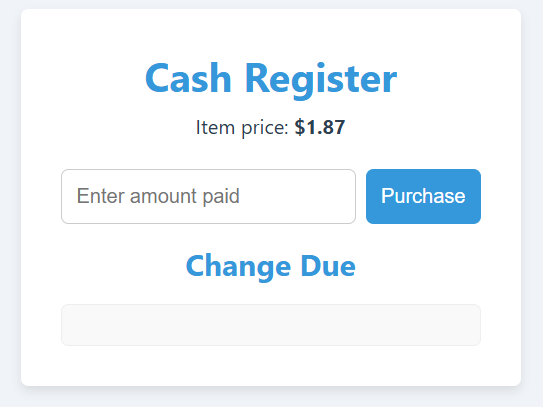

# Cash Register App

A web-based cash register simulator for small shops or point-of-sale demos. Ring up items, calculate totals (with tax), accept payment, and show change due—all in your browser.

## Features

- **Add Item**: Enter item name, price, and quantity to ring it up  
- **Item List**: Displays all current line items with name, unit price, quantity, and line total  
- **Edit & Remove**: Update quantity or remove any item from the register  
- **Subtotal & Tax**: Calculates subtotal and applies a configurable tax rate  
- **Total Due**: Shows the grand total (subtotal + tax)  
- **Payment & Change**: Enter payment amount and instantly see change due  
- **Clear Register**: Reset all items and calculations with one click  
- **Responsive Design**: Optimized for desktop and tablet POS layouts  

## Demo

Open `index.html` in your browser or view the live demo:  
<https://sadykovismail.github.io/Java-script/39-cash-register/>



## Installation

_No dependencies or build tools required!_

1. Clone this repository:  
   ```bash
   git clone https://github.com/sadykovIsmail/Java-script/tree/main/39-cash-register
Open index.html in any modern web browser.

Usage
In the Add Item form, enter:

Name of the product

Price per unit (e.g. 4.99)

Quantity (e.g. 2)

Click Add to append the line item to the list.

Adjust quantities directly in the list or click the 🗑️ icon to remove an item.

The Subtotal and Tax (default 8.25%) update automatically.

View the Total Due at the bottom.

In the Payment field, type the amount received and click Process Payment.

See the Change Due displayed immediately.

Click Clear Register to reset everything for the next customer.

Tech Stack
HTML5 for structure

CSS3 for styling and responsive layout

Vanilla JavaScript (ES6+) for register logic, tax calculations, and DOM manipulation

File Structure
bash
Копировать код
cash-register-app/
├── index.html           # Main HTML page
├── css/
│   └── styles.css       # App styles
├── js/
│   └── script.js        # Register logic & event handlers
└── README.md            # Project documentation

Contributing
1) Fork the repo

2) Create a new branch:
git checkout -b feature/<your-branch-name>

3) Commit your changes:
git commit -m "Add awesome feature"

4) Push to the branch:
git push -u origin feature/<your-branch-name>

5) Open a Pull Request