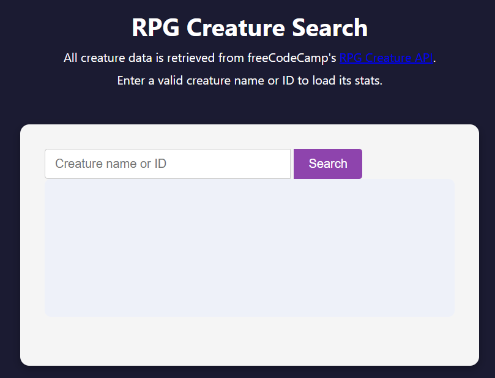

# RPG Creature App

A browser-based app to browse, filter, and generate fantasy RPG creatures. Perfect for game masters or players looking to populate their world with unique monsters.

## Features

- **Creature Cards**: Displays each creature’s name, image, type (Beast, Undead, Elemental, etc.), hit points, attack, and defense  
- **Search & Filter**: Live search by name and filter by creature type or challenge rating  
- **Random Generator**: Click **Generate Random** to add a brand-new creature with randomized stats  
- **Detail View**: Click a card to flip it and reveal lore or special abilities  
- **Responsive Layout**: Adapts seamlessly from mobile to desktop screens  
- **Persistent Storage**: Your custom creatures are saved in `localStorage` so they persist across sessions  

## Demo

Open `index.html` in your browser or view the live demo:  
<https://sadykovismail.github.io/Java-script/40-rpg-creature-search-app>



## Installation

_No build tools or external dependencies required!_

1. Clone this repository:  
   ```bash
   git clone https://github.com/sadykovIsmail/Java-script/tree/main/40-rpg-creature-search-app
Open index.html in any modern web browser.

Usage
Browse the Creature Cards grid on load.

Use the Search input to filter creatures by name.

Use the Type dropdown to narrow results by creature type.

Click Generate Random to create a new creature with random stats.

Click any card to flip it and read detailed lore, abilities, or weaknesses.

To remove a creature, click the 🗑️ icon on its card.

Your additions and edits are auto-saved; refresh to continue where you left off.

Tech Stack
HTML5 for semantic markup

CSS3 (Flexbox & Grid) for styling and responsive design

Vanilla JavaScript (ES6+) for data handling, filtering, random generation, and localStorage integration

File Structure

rpg-creature-app/
├── index.html              # Main HTML page with creature grid
├── css/
│   └── styles.css          # App styles and responsive rules
├── js/
│   └── script.js           # Core logic: rendering, 
|
└── README.md               # Project documentation

Contributing
1) Fork the repo

2) Create a new branch:
git checkout -b feature/<your-branch-name>

3) Commit your changes:
git commit -m "Add awesome feature"

4) Push to the branch:
git push -u origin feature/<your-branch-name>

5) Open a Pull Request